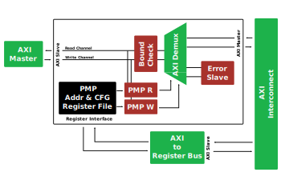

[](https://github.com/andreaskuster/axi-io-pmp/actions/workflows/main.yml)
[](LICENSE)

# AXI IO-PMP


Author: Andreas Kuster <mail@andreaskuster.ch>  
Maintainer: Nils Wistoff <nwistoff@iis.ee.ethz.ch>

This repository contains an AXI-compliant IO-PMP for RISC-V.

## License
AXI IO-PMP is released under Solderpad v0.51 (SHL-0.51) see [`LICENSE`](LICENSE)

## Getting Started

### Install & Requirements
All relevant linux packages and the python virtual environment can be setup by calling
```bash
source setup_env.sh
```

### Run Tests
Pytest:
```bash
pytest tb/
```

Show waveform of the simulation:
```bash
gtkwave sim_build/axi_io_pmp.vcd
```

### Modules List

| Name                                                            | Description |
|-----------------------------------------------------------------|-------------|
| [`dut`](src/dut.sv)                                             | Device under test - Top level module for simulation and synthesis           |
| [`axi_io_pmp`](src/axi_io_pmp.sv)                               | Traditional AXI IO-PMP module            |
| [`axi_master_connector`](src/connector/axi_master_connector.sv) | Connects the generic AXI Master Verilog interface to the pulp-platform type-based (axi_req_t, axi_rsp_t) pair.            |
| [`axi_slave_connector`](src/connector/axi_slave_connector.sv)   | Connects the generic AXI Slave Verilog interface to the pulp-platform type-based (axi_req_t, axi_rsp_t) pair.            |
| [`riscv`](src/pmp/include/riscv.sv)                             | RISC-V PMP type definition package.            |
| [`pmp_entry`](src/pmp/pmp_entry.sv)                             | Single RISC-V PMP entry            |
| [`pmp`](src/pmp/pmp.sv)                                         | Purely combinational PMP unit (base from pulp-platform/CVA6, extended by: IOGranularity, TODO: tag checker)            |
| [`io_pmp_reg_pkg`](src/register/io_pmp_reg_pkg.sv)              | Register interface package            |
| [`io_pmp_reg_top`](src/register/io_pmp_reg_top.sv)              | Register interface top level module            |


### AXI Compliance and PMP Correctness

Even though a AXI4 burst transaction could theoretically be 256 transfers with a burst size of 128 (given 128bit data width) resulting in a total burst size of 8KB (INCR type), however a burst must not cross a 4KB address boundary, which means that the maximal burst size is 4KB.

- Write Burst

With a granularity of 4KB, we can check every burst in a single cycle (given the PMP can check one address per cycle). This is a trade-off. One could also multi-cycle check the whole burst interval while stalling the transaction until ready. And then signal the response. A hybrid version is to buffer all write, while checking the regions, and letting them through upon success, or throw them away upon failure (while sending feedback afterwards)

- Read Burst

With a granularity of 4KB, we can check every burst in a single cycle (given the PMP can check one address per cycle). This is a trade-off. One could also multi-cycle check the whole burst interval while stalling the transaction until ready.

This makes the read response compliant to AXI specs as well (i.e. every transfer gets a SLVERR, AXI states to sent OKAY/SLVERR/.. per transfer, and generally not for the whole burst). This is a trade-off. One could also split the burst, and assemble it again (signaling the ones that are OKAY, as OKAY, and inserting those that were blocked as SLVERR with no valid data)

### Register Generation
The OpenTitan register tool can be used as a standalone component to generate RTL registers, including the corresponding documentation and C header files.

Re-generation of these files can be initiated by the following command sequence:
```bash
cd src/register
make
```

More information can be found in the [OpenTitan Register Tool Doc](https://docs.opentitan.org/doc/rm/register_tool/).

### Frequently Asked Questions

#### Occured Errors & Solutions

Error `Error: System task/function $from_myhdl()/$to_myhdl() is not defined by any module`:
```bash
./myhdl.vpi: Unable to find module file `./myhdl.vpi' or `./myhdl.vpi.vpl.vpi'.
test_axi_register.v:153: Error: System task/function $from_myhdl() is not defined by any module.
test_axi_register.v:202: Error: System task/function $to_myhdl() is not defined by any module.
```

Solution: (Re-)build `myhdl.vpi` and copy it to a search path location
```bash
git clone https://github.com/myhdl/myhdl.git
cd myhdl/cosimulation/icarus
make
```
